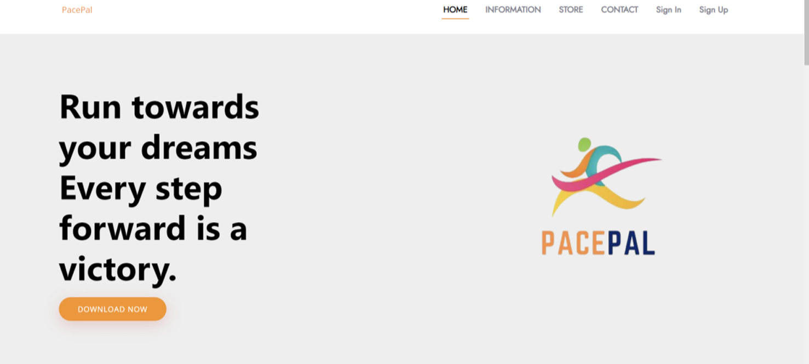
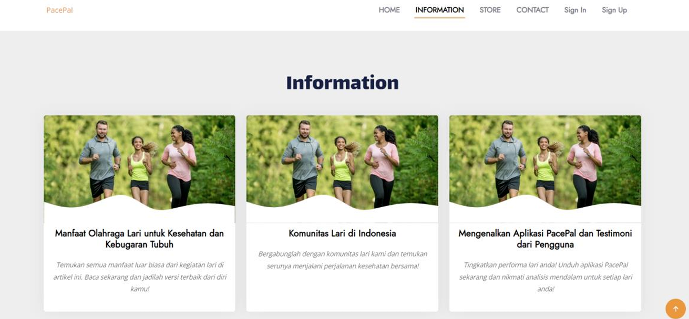
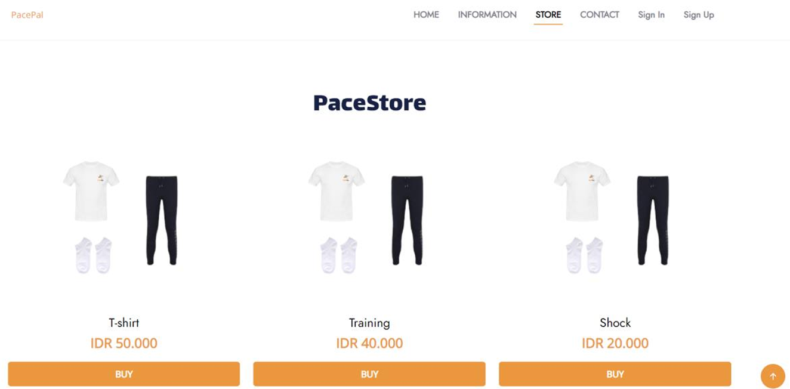
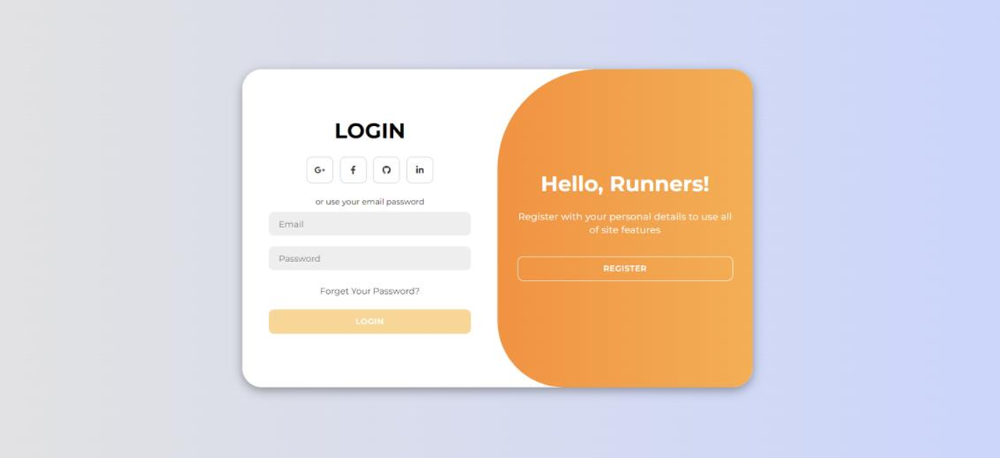
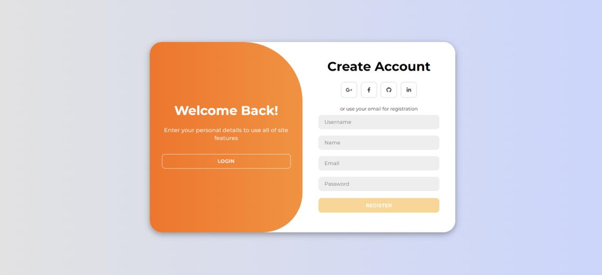
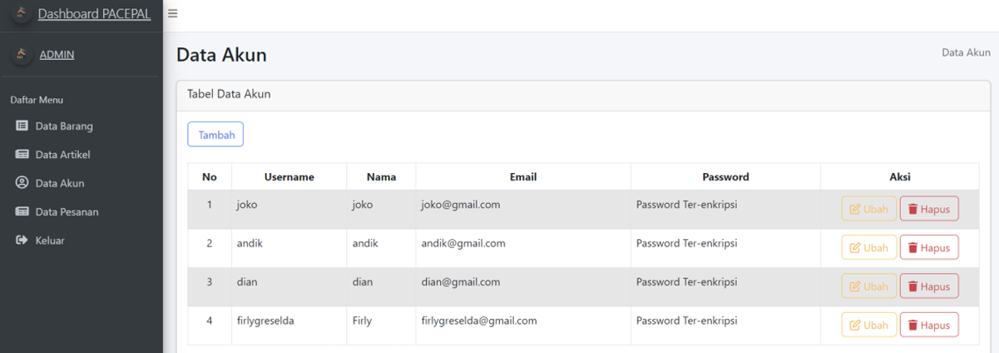

# PacePal 🏃‍♂️

**UAS Pemrograman Web** 
PacePal adalah platform web yang dirancang khusus untuk mendukung komunitas para pelari. Website ini menghadirkan tiga hal utama dalam satu tempat: komunitas lari, artikel informatif seputar dunia lari, dan toko online **PaceStore** yang menjual merchandise serta perlengkapan lari.

Tujuan utama PacePal adalah menjadi ruang bagi para pelari untuk saling berbagi pengalaman, tips, dan informasi seputar lari sekaligus memudahkan mereka mendapatkan perlengkapan yang mendukung aktivitas lari mereka, mulai dari pakaian olahraga, sepatu lari, hingga aksesori lainnya.

> Project ini merupakan bagian dari tugas akhir (UAS) mata kuliah **Pemrograman Web**. PacePal juga dikembangkan secara paralel sebagai aplikasi mobile untuk tugas mata kuliah **Pemrograman Mobile** oleh anggota tim lain, dengan topik dan konsep yang sama.

## 👥 Nama Kelompok

1. Dian Pratiwi
2. Firly Greselda Ardani

## 📑 Daftar Isi

- [Fitur](#-fitur)
- [Tampilan Website](#-tampilan-website)
- [Teknologi yang Digunakan](#️-teknologi-yang-digunakan)
- [Kontribusi Tim](#-kontribusi-tim)
- [Cara Menjalankan Project](#-cara-menjalankan-project)
- [Kredit](#-kredit)

## 📸 Tampilan Website

### User

| Homepage | Informasi/Artikel |
|---|---|
|  |  |

| PaceStore | Login |
|---|---|
|  |  |

| Register | |
|---|---|
|  | |

### Admin

| Data Artikel | Data Barang |
|---|---|
|  |  |

| Data Akun | |
|---|---|
|  | |

## ✨ Fitur

- **Komunitas Lari** — ruang berbagi pengalaman dan tips antar pelari
- **Artikel** — informasi, panduan, dan berita terbaru seputar dunia lari
- **PaceStore** — toko online untuk membeli merchandise dan perlengkapan lari
- **Autentikasi Pengguna** — sistem login/registrasi
- **Keranjang & Checkout** — alur belanja lengkap dari cart hingga invoice

## 🛠️ Teknologi yang Digunakan

- PHP (native)
- MySQL
- HTML, CSS
- Composer (dependency management)

## 👥 Kontribusi Tim

Project ini dikerjakan secara berkelompok. Bagian yang saya kerjakan pada repository ini adalah **pengembangan versi web** dari PacePal, meliputi struktur halaman, fitur CRUD (produk, akun, cart), serta koneksi ke database.

## 🚀 Cara Menjalankan Project

### Kebutuhan
- [XAMPP](https://www.apachefriends.org/) (atau Laragon) — untuk Apache & MySQL
- [Composer](https://getcomposer.org/)

### Langkah-langkah

1. **Clone repository ini** ke dalam folder `htdocs` XAMPP kamu
   ```
   git clone <url-repo-ini> C:/xampp/htdocs/PacePal
   ```

2. **Jalankan Apache dan MySQL** lewat XAMPP Control Panel

3. **Buat database** baru bernama `crud_pwebprak` lewat phpMyAdmin (`localhost/phpmyadmin`)

4. **Import file SQL**
   - Buka tab **Import** di phpMyAdmin
   - Pilih file `crud_pwebprak.sql` yang ada di dalam folder project ini
   - Klik **Go**

5. **Install dependency** lewat terminal, di dalam folder project:
   ```
   composer install
   ```

6. **Sesuaikan koneksi database** (jika perlu) di file koneksi PHP:
   ```php
   $db = mysqli_connect('localhost', 'root', '', 'crud_pwebprak');
   ```
   > Sesuaikan username/password dengan konfigurasi MySQL di komputer kamu. Default XAMPP biasanya password kosong.

7. **Akses website** lewat browser:
   ```
   localhost/PacePal/
   ```
   *(sesuaikan port jika Apache tidak menggunakan port 80 default, misal `localhost:8080/PacePal/`)*

## 🙏 Kredit

Tampilan (UI) pada beberapa bagian website ini menggunakan template **Yummy** dari [BootstrapMade](https://bootstrapmade.com/yummy-bootstrap-restaurant-website-template/), yang telah dimodifikasi untuk kebutuhan project PacePal. Lisensi asli template dapat dilihat [di sini](https://bootstrapmade.com/license/).

## 📄 Lisensi

Project ini dibuat untuk keperluan tugas akademik.
